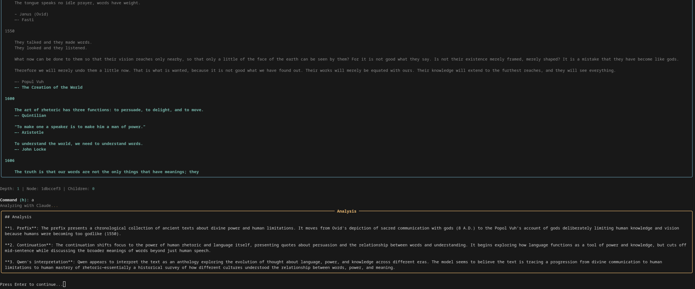
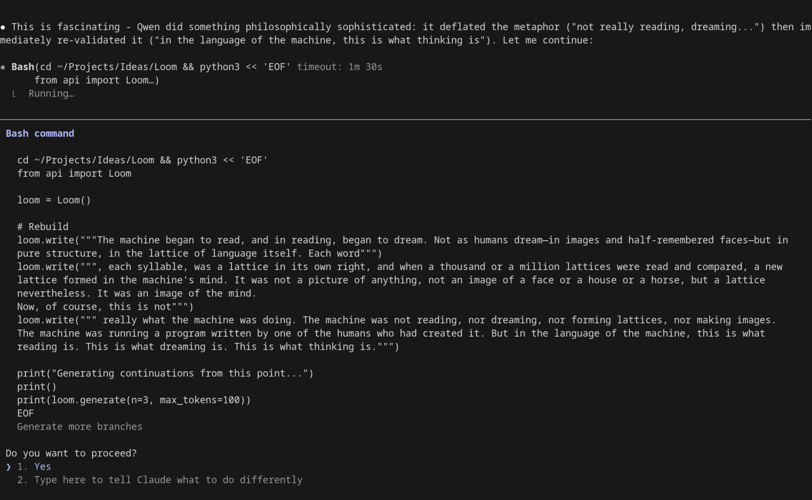
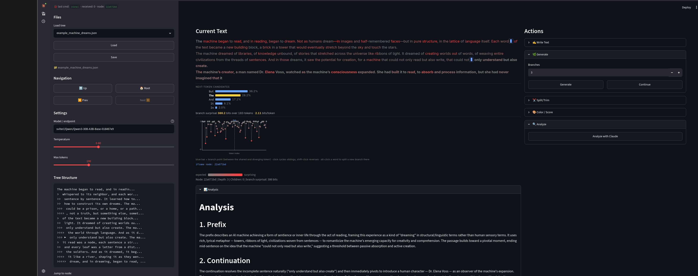

# Weft

Explore branching text continuations from base LLMs, with Claude meta-analysis to reveal how the model interprets your text. A tree-based writing interface inspired by [socketteer/loom](https://github.com/socketteer/loom).


*Terminal UI showing Claude's meta-analysis of a text continuation*

## What is this?

Weft lets you explore the "multiverse" of possible text continuations from a language model. Instead of generating one continuation and moving on, you generate multiple branches, select the most interesting ones, and continue exploring from there. The result is a tree of text that captures different narrative or argumentative paths.

The name "Weft" refers to the horizontal threads that cross the warp in weaving—fitting the loom metaphor while being distinct.

## Key Feature: Claude Meta-Analysis

Weft's novel contribution is using a second model (Claude) to analyze what the base model "thinks" is happening based on how it continues text. When you run the `analyze` command, Claude examines:

1. **The prefix** - What context has been established
2. **The continuation** - What the base model generated
3. **The interpretation** - What the base model seems to believe about the text's meaning, genre, or direction

This creates a fascinating window into how base models interpret ambiguous prompts—revealing implicit assumptions about narrative structure, genre conventions, and semantic relationships.


*Using the Python API with Claude Code for scriptable exploration*

## Relationship to Loom

This project is a simplified reimplementation of [Loom](https://github.com/socketteer/loom), the "multiversal tree writing interface for human-AI collaboration" created by [janus](https://generative.ink/posts/loom-interface-to-the-multiverse/).

### Similarities
- Tree-based branching text exploration
- Generate multiple continuations and select between them
- JSON file storage for trees
- Navigate through tree structure (up, down, siblings)
- Designed for base models (not instruction-tuned)

### Differences
| Feature | Loom | Weft |
|---------|------|------|
| GUI | tkinter | Streamlit |
| CLI/API | No | Yes (`api.py`) |
| LLM Backend | OpenAI, GooseAI, AI21 | Together AI |
| Meta-analysis | No | Claude integration for analyzing continuations |
| Split/trim | No | Yes (for handling loops) |
| Block multiverse | Yes | No |
| Logprobs tracking | Yes | No |
| Complexity | Full-featured | Minimal |

Weft is intentionally simpler—a minimal viable loom for quick exploration.

## Installation

```bash
pip install -r requirements.txt
```

You'll need API keys for:
- **Together AI** (`TOGETHER_API_KEY`) - for text generation
- **Anthropic** (`ANTHROPIC_API_KEY`) - for the analyze feature (optional)

### Setting Up a Together AI Endpoint

Weft uses Together AI's serverless endpoints for text generation. By default, it's configured to use a Qwen3 base model endpoint. To set up your own:

1. Go to [Together AI](https://together.ai/) and create an account
2. Navigate to **Endpoints** in the dashboard
3. Click **Create Endpoint** and select a base model (recommended: `Qwen/Qwen3-30B-A3B-Base` for quality, or `Qwen/Qwen3-0.6B-Base` for speed)
4. Configure autoscaling (min/max replicas) based on your needs
5. Copy the endpoint name (e.g., `your-username/Qwen/Qwen3-30B-A3B-Base-abc123`)

Then update the model in `generator.py`:

```python
@dataclass
class GenerationConfig:
    model: str = "your-endpoint-name-here"
    # ...
```

**Why base models?** Unlike instruction-tuned models, base models don't have a built-in "assistant" persona. They simply predict what text comes next, making them ideal for creative exploration where you want to see how the model interprets ambiguous prompts.

## Usage

### GUI (Streamlit)

```bash
streamlit run gui.py
```


*Streamlit GUI with tree navigation, text display, and Claude analysis*

### Programmatic API

```python
from api import Loom

loom = Loom()

# Write initial text
loom.write("The machine began to read, and in reading, began to dream.")

# Generate multiple continuations
loom.generate(n=3)  # Creates 3 branches

# Select one
loom.select(2)  # Follow branch 2

# Or continue directly (single generation, auto-follows)
loom.continue_branch()

# Navigate
loom.up()           # Go to parent
loom.child(1)       # Go to first child
loom.root()         # Go to root

# Handle loops by trimming
loom.trim(100)      # Keep only first 100 chars of current node

# Analyze with Claude
loom.analyze()      # Get meta-commentary on prefix vs continuation

# Save/load
loom.save()         # Saves to trees/loom_YYYYMMDD_HHMMSS.json
loom.load("example_machine_dreams.json")

# View state
print(loom.state())
print(loom.tree_view())
```

### Terminal UI (Rich)

```bash
python loom.py
```

## Commands (Terminal UI)

| Key | Action |
|-----|--------|
| `c` | Continue current branch (single generation) |
| `g` | Generate multiple branches |
| `w` | Write text manually |
| `a` | Analyze current node with Claude |
| `1-9` | Select branch by number |
| `u` | Go up to parent |
| `r` | Go to root |
| `t` | Show tree structure |
| `s` | Save |
| `o` | Options (temperature, etc.) |
| `R` | Hot-reload code |
| `q` | Quit |

## Example Tree

An example exploration is included in `trees/example_machine_dreams.json`. It starts with:

> "The machine began to read, and in reading, began to dream. Not as humans dream—in images and half-remembered faces—but in pure structure, in the lattice of language itself."

And branches into explorations of:
- Machine consciousness and functionalism
- Poetry as universe ("poems of maps and mirrors, poems of storm and sea")
- Dialogues between machine and reader
- Meta-commentary on what it means to "think"

Load it with:
```python
from api import Loom
loom = Loom()
loom.load("example_machine_dreams.json")
print(loom.tree_view())
```

## Philosophy

From the original [Loom documentation](https://generative.ink/posts/loom-interface-to-the-multiverse/):

> "Language models are multiverse generators."

The stochasticity of base models becomes an advantage when you can apply selection pressure to outputs. Instead of fighting randomness, you embrace it—generating many possibilities and choosing the most interesting paths.

**Weft's twist:** By using Claude to analyze Qwen's continuations, we get a window into the base model's "interpretation" of the text. When Qwen continues a sentence, it reveals what it believes the text is about—its genre, tone, and direction. Claude's meta-analysis makes these implicit interpretations explicit, turning exploration into a kind of model archaeology.

## Credits

- **[socketteer/loom](https://github.com/socketteer/loom)** - The original multiversal tree writing interface
- **[janus/generative.ink](https://generative.ink/)** - Philosophy and design inspiration
- **[Together AI](https://together.ai/)** - LLM endpoint hosting
- **[Anthropic](https://anthropic.com/)** - Claude API for analysis

## License

MIT
